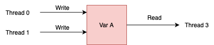

# Parallel Programming with OpenMP

This tutorial demonstrates how we can use OpenMP for shared memory programming.

Learning outcomes of the tutorial are:
1. Learn how to program for shared memory using OpenMP.
2. Learn how to use tasks in OpenMP.


Prerequisite:
1. Experience with C Programming.
* * *

## Shared Memory

<p align="center">
  
</p>

In a shared memory system, multiple CPUs are organized into distinct regions known as NUMA regions. Each of these regions exhibits varying affinities towards specific portions of memory, and multiple CPUs can be present within each NUMA region. The provided diagram illustrates two NUMA regions, each with a single CPU. These CPUs possess multiple cores, each capable of independently executing arithmetic and logic operations. Furthermore, each core maintains its own L1 cache, and depending on the system's architecture, all cores in a NUMA region may share an L2 cache, while NUMA regions may share an L3 cache. The diagram in question depicts only L1 and L2 caches.

When running a sequential program, we utilize just one core from one of the NUMA regions. However, the program's performance can be significantly enhanced if it can distribute concurrent tasks to different cores.

You can use the command `lstopo` to find the architecture of your machine. `lstopo` on Gadi login nodes will give you the following:
<p align="center">
  
</p>

## Threads 

<p align="center">
  
</p>

A thread is a sequential independent execution stream that executes different tasks in order. Typically, a thread is a constituent component of a process, and a single process can have multiple threads. Each thread maintains its own program counter, stack memory, and registers. Nevertheless, threads within the same process share the heap memory and it can potentially share the same code and data.

Each process has an upper bound on the number of threads it can handle. This number can be found using the command:
```
cat /proc/sys/kernel/threads-max
```

The operating system assigns a thread to a core, allowing the thread to utilize the core's ALU for instruction execution. At any moment, only one thread can access a particular ALU within a core. Consequently, when the number of threads assigned to a core exceeds the core's available ALUs, the OS performs `context switching`, cycling between the various threads allocated to that core. Typically, in high-performance computing (HPC), it is customary to launch a number of threads equal to the number of available cores, thereby ensuring minimal context switching.

## Fork-Join Parallelism

<p align="center">
  
</p>

The fork-join method is a parallel computing technique in which the program's execution branches or `forks` at specific points and later converges or `joins` at subsequent points. In the fork phase, individual threads execute parallel segments of the program that can be processed simultaneously. In the join phase, the program resumes its execution in a sequential manner, much like a traditional sequential program. OpenMP follows the fork-join model of paralleism. 

## Sample Application

In this tutorial we will be mainly using 3 applications to demonstrate the different aspcts of OpenMP:
* Calculating the [value of `π`](./applications/pi.md) using monte carlo method.
* Finding [Mandelbrot](./applications/mandelbrot.md) fractal by Monte Carlo sampling.
* Tiled [Cholesky Factorization](./applications/cholesky.md).

## The Performance Application Programming Interface (PAPI)

The Performance Application Programming Interface (PAPI) provides an interface and methodology for collecting performance counter information from various hardware and software components. In this tutorial, we will be using PAPI in some of the programs. 

In this tutorial, we will be using PAPI v5.7.0 in some of our programs and the program [`papi.c`](./src/papi.c) demonstrates how we can use the PAPI API.


## OpenMP API

The OpenMP Application Program Interface (API) is a portable, scalable model that gives shared-memory parallel programmers a simple and flexible interface for developing parallel applications. The OpenMP standard supports multi-platform shared-memory parallel programming in C/C++ and Fortran. It is jointly defined by a group of major computer hardware and software vendors and major parallel computing user facilities. For more information, see the [OpenMP website](http://www.openmp.org).

OpenMP consists of a set of program directives and a small number of function/subroutine calls. The function/subroutine calls are associated with the execution runtime environment, memory locking, and timing. The directives are primarily responsible for the parallelization of the code. For C/C++ code, the directives take the form of _pragmas_:

`#pragma omp`

A program written using OpenMP directives begins execution as a single process, or "master thread". A single thread executes sequentially until it encounters the first parallel construct. When this happens, a team of threads is created, and the original thread assumes the role of master. Upon completion of the parallel construct, the threads synchronize (unless specified otherwise), and only the master continues execution. Any number of parallel constructs may be specified in the program, and as a result, the program may "fork" and "join" many times.

The number of threads that are spawned may be:

*   explicitly given as part of the pragma;
*   set using one of the OpenMP function calls; or
*   predefined by an environment variable or a system setup default.

We note that the number of threads may exceed the number of physical cores (CPUs) on the machine; this is known as *over-subscription*. When over-subscription occurs, it is up to the operating system to schedule the threads as best it can among available cores. Even if the user requests a high thread count, the OpenMP runtime will generally avoid over-subscription, as it can reduce performance. This behaviour is controlled by the `OMP_DYNAMIC` environment variable (default `true`), allowing the runtime to "adjust the number of threads to use for executing parallel regions to optimize the use of system resources". Setting `OMP_DYNAMIC=false` disables this behaviour, requiring OpenMP to spawn the requested number of threads.

## OpenMP Directives

### `parallel` Regions

A _parallel region_ is a structured block of code that is to be executed in parallel by a number of threads. Each thread executes the structured block independently. _Note: it is illegal for code to branch out of a parallel region._ The basic structure of the [parallel construct](https://www.openmp.org/spec-html/5.1/openmpse14.html#x59-590002.6) is as follows:

```c
#pragma omp parallel [clause[ [,] clause] ... ]
{
    /*structured block*/
}
```

As an example, consider the following code:

```c
#include <omp.h>
#include <stdio.h>

int main(void) 
{

  printf("Total number of threads allocated in the parellel section %d \n", omp_get_num_threads() );
  #pragma omp parallel 
  {
    printf("This is run by thread %d \n", omp_get_thread_num());
  }
  
  return 0;
}
```


The above code is contained in file [`openmp_parallel_region.c`](./src/openmp_parallel_region.c). Compile it by typing:
```
make openmp_parallel_section
```

> **_NOTE:_**   Each program can be compiled by: *make \<program name\>*

> **_NOTE:_**  All the programs can be compiled in a single go by: *make all*

1. Run the code by typing `./openmp_parallel_region`
  
2. Now run the code with 4 threads by first setting the `OMP_NUM_THREADS` variable to 4
    
        OMP_NUM_THREADS=4 ./openmp_parallel_region

3. Now run the code by setting the `OMP_DYNAMIC` to true
    
        OMP_DYNAMIC=true ./openmp_parallel_region

What difference do you see between the different runs?

There is no guarantee that the requested number of threads will be allocated. `omp_get_num_threads()` provides the actual allocated thread count, and `omp_get_thread_num()` retrieves a thread's index. When designing an OpenMP program, focus on building the algorithm for the allocated threads, not the requested number. 

Some other useful OpenMP routines are:

*   [`omp_set_num_threads(np)`](https://www.openmp.org/spec-html/5.1/openmpsu120.html#x159-1920003.2.1): sets the number of parallel threads to be used for parallel regions
*   [`omp_get_max_threads()`](https://www.openmp.org/spec-html/5.1/openmpsu122.html#x161-1940003.2.3): gives the maximum number of threads that could be used

The above three functions are used in the program [`openmp_max_threads.c`](./src/openmp_max_threads.c).

4. Make and run the program `openmp_max_threads.c`. Run the program using

        ./openmp_max_threads 10

 How many threads are created? What is the maximum threads allowed? 


	

### The `reduction` Clause

A [reduction clause](https://www.openmp.org/spec-html/5.1/openmpsu117.html#x152-1720002.21.5) can be added to the parallel directive. This specifies that the final values of certain variables are combined using the specified operation (or intrinsic function) at the end of the parallel region. For example, consider the program [`openmp_reduction.c`](./src/openmp_reduction.c), which demonstrates a number of reduction operations and also shows the use of the [`omp_get_thread_num()`](https://www.openmp.org/spec-html/5.1/openmpsu123.html#x162-1950003.2.4) routine to uniquely define each thread.

The following table shows the initial value assigned to a reduction variable for each reduction operation.

| Operator | Initial Value |
|--------- |--------- |
| + | 0 |
| - | 0 |
| * | 1 |
| & | ~ 0 |
| \| | 0 |
| ^ | 0|
| && | 1 |
| \|\| | 0 |
| max | Least representable number  |
| min | Largest representable number  |


5. Run the program [`openmp_reduction.c`](./src/openmp_reduction.c) with four threads and make sure you understand what is happening.
    
        make openmp_reduction
        OMP_NUM_THREADS=4 ./openmp_reduction

### The Datasharing Clause

The optional `clause`s can be used to define data sharing as follows:

*   `shared(list)` specifies variables that are visible to all threads. If you specify a variable as shared, you are stating that all threads can safely share a single copy of the variable.
*   `private(list)` specifies that each thread has its own uninitialized local copy of each variable listed.
*   `firstprivate(list)` specifies that each thread has its own local copy of each variable listed, which is initialized to the value that the variable has on entry to the block.
*   `default(data-sharing-attribute)` - where for C/C++ the `data-sharing-attribute` is either `shared` or none. When you specify the default `data-sharing-attribute`, you declare the default for all variables in the code block to be shared or to have no default (none). _Note - Fortran also permits a default of `private`. This is not available in C/C++ since many of the standard libraries use global variables, and scoping these as local would give errors._

6. Run the program [`openmp_datasharing.c`](./src/./openmp_datasharing.c) with four threads and identtify the difference between the different clauses.
    
        make openmp_datasharing
        OMP_NUM_THREADS=4 ./openmp_datasharing

### Exercise 1

7. The program [`exercise1.c`](./src/exercise1.c) computes the sum of all integers from 1 to `num_elem`, and creates `p` OpenMP threads. Currently, this task is performed using the following loop, using only the main thread:

  ```c
        sum = 0;
        i = 0;
        
        while (i < nele) {
          i++;
          sum += i;
        }
  ```
Parallelize this summation by using OpenMP to manually divide (this means you are not to convert this to a `for` loop and use `#pragma omp for`) up the loop operations amongst the available OpenMP threads. Your parallel code must continue to use a `while` construct. Solution is available in [`exercise1_solution.c`](./src/exercise1_solution.c).

### Race Condition and Critical Sections 

<p align="center">
  
</p>

A _race condition_ arises when two threads simultaneously access a shared variable. Initially, the first thread reads the variable, and shortly thereafter, the second thread reads the same value from that variable. Subsequently, both the first and second threads carry out their respective operations on the value, and a race ensues to determine which thread can write its value last to the shared variable. The final value preserved in the shared variable is that which is written by the thread that manages to write its value last, effectively overwriting any prior values set by other threads. 

A _critical section_ refers to a segment of code responsible for accessing shared resources, such as variables or data structures. This section necessitates exclusive execution by a single process at any given moment to prevent the occurrence of race conditions and other synchronization-related problems.

In the solution of the previous excercise you can see this race condition. Every time you run the program you may get a different value for sum. This problem can be addressed in OpenMP using `critical` or `atomic` construct.

### The `critical` Construct

The [critical construct](https://www.openmp.org/spec-html/5.1/openmpsu99.html#x132-1420002.19.1) ensures that a block of code is only executed by one processor at a time. Effectively this serializes portions of a parallel region.

```c
#pragma omp critical [(name)]
{
  /*structured block*/
}
```

A thread will wait at the beginning of the critical section until no other thread in the team is executing that (named) section.

### The `atomic` Construct

The [atomic construct](https://www.openmp.org/spec-html/5.1/openmpsu105.html#x138-1480002.19.7) ensures that memory locations are accessed atomically, to help avoid race conditions or reads or writes that would result in indeterminate values.

`#pragma omp atomic`

The directive refers to the line of code immediately following it. Be aware that there may be an overhead associated with the setting and unsetting of locks - so use this directive and/or critical sections only when necessary. For example, we could use the atomic construct to parallelize an inner product:

```c
#pragma omp parallel for shared(a,b,sum) private(I,tmp)
for (i = 0; i < n; i++) {
  tmp = a[i] * b[i];
  #pragma omp atomic
  sum = sum + tmp;
}
```

but the performance would be very poor!

### Exercise 2

8. The program [`exercise1.c`](./src/exercise1_solution.c) has a race condition. Solve this race condition using the the construct `atomic`. The solutions are availble in [`exercise2_solution.c`](./src/exercise2_solution.c).


### False Sharing

<p align="center">
  
</p>

All modern processors use cache. Accessing a memory location not only copy that memory location, but a slice of memory to me moved to the cache. This slice of memory is called __cache line__. For example when you aceess an array element `A[N]` there is a good chance `A[N+1]` and `A[N+2]` is also moved to the cache. 

Concurrent updated to separate elements within a shared cache line by different processors cause the entire cache line to be invalidated, despite the logically independent nature of these updates. Each update to an element within the cache line flags the entire line as invalid, affecting other threads attempting to access different elements within the same line. Consequently, they are compelled to retrieve a fresher version of the line from memory or an alternate source, even if the specific element they're accessing hasn't been altered. This occurs because cache coherence operates at the level of cache lines, not individual elements. Consequently, it leads to amplified interconnect activity and additional processing overhead. Furthermore, during the update of the cache line, access to the elements within it is restricted.

For instance if Thread T1 changes the data `A[N]` it will make the entire cache line invalid. Which means the data `A[N+1]` and `A[N+2]` also becomes invalid. So, if Threard T2 tries to access `A[N+1]` it will see that the the cache line is invalid and will fetch the data from the memory. This is __false sharing__. 

<p align="center">
  
</p>

Some methods to avoid false sharing are:
* Refrain from modifying global data accessed by multiple threads.
*  Ensure that shared global data is aligned with cache line boundaries.
*  Avoid using an array indexed by thread ID or rank to store temporary, thread-specific data.
* When parallelizing an algorithm, partition data sets along cache lines, rather than across them.

<p align="center">
  
</p>

9. The programs [`openmp_false_sharing`](./src/openmp_false_sharing.c) and [`openmp_false_sharing_avoid`](./src/openmp_false_sharing_avoid.c) demonstrates false sharing and a method to avoid it.

### The Worksharing-Loop Construct (`for`)

In the program [`exercise2_solution.c`](./src/exercise2_solution.c), we parallelized a loop by manually assigning different loop indices to different threads. With `for` loops, OpenMP provides the [worksharing-loop construct](https://www.openmp.org/spec-html/5.1/openmpsu48.html#x73-730002.11.4) to do this for you. This directive is placed immediately before a for loop and automatically partitions the loop iterations across the available threads.

```c
#pragma omp for [clause[[,]clause ...]
for (...) { ... }
```

[openmp_parallel_for.c](./src/openmp_parallel_for.c) demonstrates how the work the `for` construct works. Note that `for` construct only handles the distribution of work to different threads. We still have to manage the critical sections and make sure there are no race conditions.

### Exercise 3

10. [exercise3.c](./src/exercise3.c) calculates the value [`π` Using Monte Carlo Method](./applications/pi.md). Parallelize the program using the `for` construct. The solution is available in [exercise3_solution.c](./src/exercise3_solution.c).

### The `schedule` Construct

An important optional clause is the `schedule(type[,chunk])` clause. This can be used to define specifically how the iterations are divided amongst the different threads. Two distribution schemes are:

*   `(static,chunk-size)`: iterations are divided into pieces of a size specified by chunk and these chunks are then assigned to threads in a round-robin fashion.
*   `(dynamic,chunk-size)`: iterations are divided into pieces of a size specified by chunk. As each thread finishes a chunk, it dynamically obtains the next available chunk of loop indices.

11. [openmp_schedule.c](./src/openmp_schedule.c) demonstrates how the two scheduling options differ from one another.
        
    	./openmp_schedule


### Exercise 4

12. The program [exercise4.c](./src/exercise4.c) generates the [mandelbrot](./applications/mandelbrot.md) set. Paralleize the program using different OpenMP directives. Test how `static` and `dynamic` influences the performance of the program. The solution is available in [exercise4_solution.c](./src/exercise4_solution.c).

### The `barrier` Construct

In any parallel program, there will be certain points where you wish to synchronize all your threads. This is achieved by using the [barrier construct](https://www.openmp.org/spec-html/5.1/openmpsu100.html#x133-1430002.19.2).

`#pragma omp barrier`

All threads must arrive at the barrier before any thread can continue. Some OpenMP constructs have implicit barriers. 

13. Program [openmp_barrier.c](./src/openmp_barrier.c) demonstrates the working of implicit and explicit barriers. 

### `nowait` Construct

The `nowait` clause overrides any synchronization that would otherwise occur at the end of a construct. 

```c
#pragma omp for nowait [clause[[,]clause ...]
for (...) { ... }
```

14. Program [openmp_nowait.c](./src/openmp_nowait.c) demonstrates how we can use nowait with `for` construct.

### The `single` and `master` Construct

Certain pieces of code you may only want to run on one thread - even though multiple threads are executing. For example, you often only want output to be printed once from one thread. This can be achieved using the [`single` construct](https://www.openmp.org/spec-html/5.1/openmpsu43.html#x67-670002.10.2):

```c
#pragma omp single [clause]
{
  /*structured block*/
}
```

or using the [`master` construct](https://www.openmp.org/spec-html/5.0/openmpse24.html)

```c
#pragma omp master [clause]
{
  /*structured block*/
}
```

In the `single` construct the thread that encounters the code block first, executes it. While in the `master` construct the master thread always executes the code.

By default, all other threads will wait at the end of the structured block until the thread executing that block has completed. You can avoid this by augmenting the single directive with a `nowait` clause.

15. [openmp_single](./src/openmp_single.c) demonstrates how the `single` construct works
16. [openmp_master](./src/openmp_master.c) demonstrates how the `master` construct works. 

### The `sections` Construct


A program can be divided into different sections. Each of these section can be completed by a separate thread. This is especially usefull when the sections are independent of one another.

```c
#pragma omp parallel
{
	#pragma omp sections
	{
		#pragma omp section
		int sum = a + b;

		#pragma omp section 
		int diff = a - b;

		#pragma omp section 
		int prod = a * b;
	}			
}
```

17. [openmp_sections.c](./src/openmp_sections.c) demonstrates how the `sections` construct works.

### The `if` Clause

`if` clause specifies whether a code segment should be executed in parallel or in serial. `if` clause applies to `parallel`, `for` and `sections`.

```c
#pragma omp parallel if (val)
if (omp_in_parallel()) {
    ....
}
else {
    ....
}
```

All parallel programs are bound by the [Amdhal's Law](https://en.wikipedia.org/wiki/Amdahl%27s_law) - "_The overall performance improvement gained by optimizing a single part of a system is limited by the fraction of time that the improved part is actually used_".

<p align="center">
  
</p>

That is, the performance gain from parallelization is limited by the part of the program that can be parallelised. In the above diagram _Program 1_ will benefit more from parallelization when compared to  _Program 2_. 
In addition lanching threads have a non-trivial cost. So running things in parallel may not be helpful if the work to paralleised is trivial. We can use the you `if` clause to run things in parallel only if we have non-trivial work to parellelise. 

18. The program [openmp_if.c](./src/openmp_if.c) demonstrates how you can use the `if` clause. Run the program with different combination of _threads_ and _elements_. What difference do you see? 
18. Change the _THRESHOLD_ value in the program. What difference do you see? 

### The `simd` Clause

The `simd` construct facilitates the concurrent execution of multiple iterations within associated loops by utilizing SIMD instructions. Each parallel iteration is processed by a distinct SIMD lane.

```c
#pragma omp parallel for simd reduction(+: acc)
for (int k = 0; k < LIMIT; k++) {
    float mul = a[k] * b[k];
    acc += mul;
}
```


19. The program [openmp_simd.c](./src/openmp_simd.c) demonstrates how you can use the `simd` clause.
20. How does the performance differ with and without the `simd` clause?


## Task-based Computing in OpenMP

### The `tasks` Construct

Tasks in OpenMP is composed of a code segment and the data to be operated on, along with the location where the execution will happen. When a thread encounters a task construct, it can choose to execute the task immediately or defer its execution until a later time. If deferred, the task in placed in a task pool. The threads in the parellel section can remove the tasks from the task pool and execute them until the pool is empty.


```c
int fib(int n)
{
    if (n < 2) return n;

    #pragma omp task shared(l) firstprivate(n)
    l = fib(n-1);

    #pragma omp task shared(r) firstprivate(n)
    r = fib(n-2);

    #pragma omp taskwait
    return l+r;
}
```
The code block immediatly after `task` construct will be the code a task will execute. The `#pragma omp taskwait` construct specifies a wait on the completion of child tasks of the current task.

21. The program [openmp_tasks.c](./src/openmp_tasks.c) demonstrates how you can use the `task` construct.


## The `depend` Construct
The `depend` clause allows you to provide information on the how a task will access data. This also allows to define additional constraints on tasks.

Some examples of use for the depend clause:
1. `depend(in: x, y)`: the task will read variables x and y.
2. `depend(out: x)`: the task will write variable x.
3. `depend(inout: x, buffer[0:n])`: the task will both read and write variable x and the content of n elements of buffer starting from index 0.

The `depends` clause allows the programmer to create a _happens-before_ relation between tasks. For instance the code segment given below will make sure that the tasks that caclculate the value of `z` is executed only after the tasks that write to `x` and `y` is complete.

```c
#pragma omp task shared(x) depend(out: x)
write_val(&x, 10);

#pragma omp task shared(x) depend(out: y)
write_val(&y, 10);

#pragma omp task shared(x, y) depend(in: x, y)
z = read_val(&x) + read_val(&y);

```


One of the main advanatge of `depends` clause is that it removes the need of the `taskwait` clause. 

22. The program [openmp_depend.c](./src/openmp_depend.c) demonstrates how you can use the `depends` construct.

### The `untied` Construct

A task is tied if the code is executed by the same thread from beginning to end. Otherwise, the task is untied and the code can be executed by more than one thread. By default the tasks are tied in OpenMP, but this can result in performance issues. 

```c
#pragma omp task untied
{
    foo();
    #pragma omp taskyield
    bar();
}
```
The `taskyield` construct specifies that the current task can be suspended in favor of execution of a different task.

23. The program [openmp_tied.c](./src/openmp_tied.c) demonstrates how you can use the `untied`  and `taskyield` construct.


### The `taskloop` Construct

The taskloop construct is used to specify that the iterations of a loops are executed in parallel using OpenMP tasks. The iterations are distributed across tasks that are created by the construct and scheduled to be executed.

```c
#pragma omp taskloop num_tasks(20)
for (i = 0; i < N; i++) {
    arr[i] = i * i;
}
```

24. The program [openmp_taskloop.c](./src/openmp_taskloop.c) demonstrates how you can use the `taskloop` construct.
25. What difference do you see when you change the number of element and the number of tasks?

### The `taskgroup` Construct

```c
#pragma omp taskgroup
{
    #pragma omp task
    {
        #pragma omp task 
        printf("Child task \n");

        printf("Parent task \n");
    }
}
```

The `taskwait` construct dictates that the current task region remains suspended until the child tasks of the current task are completed. However, it does not indicate suspension until the descendants of the child tasks are finished. To synchronize tasks and their descendant tasks, you can enclose them within a `taskgroup` construct. 

26. The program [openmp_taskgroups.c](./src/openmp_taskgroups.c) demonstrates how you can use the `taskgroup` construct.

### Exercise 5

27. The program [exercise5.c](./src/exercise5.c) implements the [Cholesky Factorization](./applications/cholesky.md) without any parallelization. Paralleize the program using different OpenMP task directives. The solution is available in [exercise5_solution.c](./src/exercise5_solution.c).

You can run the executable using

```
./exercise5  N
```

where `N` is the Matrix dimension.


## Contributers
This course is based on material developed by current and former ANU staff, including [Peter Strazdins](https://cecc.anu.edu.au/people/peter-strazdins), [Alistair Rendell](https://www.flinders.edu.au/people/alistair.rendell), [Josh Milthorpe](http://www.milthorpe.org), [Joseph John](http://josephjohn.org) and [Fred Fung](https://nci.org.au/research/people/fred-fung).

