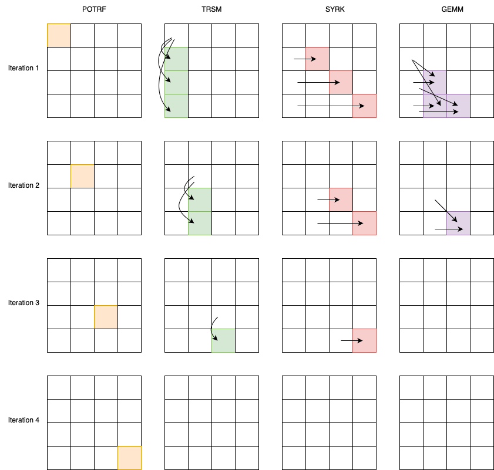

# Tiled Cholesky Decomposition

Given a Hermitian positive-definite matrix $A$, Cholesky decomposition finds $L$ such that
$A = L * L^{T}$

Where $L$ is a lower triangular matrix with real and positive diagonal entries and  $L^{T}$ is the conjugate transpose of $L$. To find decomposition we can divide the matrix into tiles and operation on some tiles will depend on another opeartion on aother tile. This will create _happens-before_ relationship between the tiles. Due to this relation Tiled Cholesky Decomposition algorithm is a good candidate for task-based algorithm.