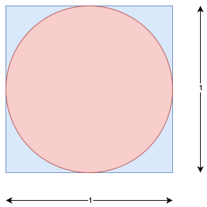

# Calculating the Value of `π` Using Monte Carlo Method

we have a circle of radius 0.5, enclosed by a 1 × 1 square. The area of the circle is:

$πr^2 = π * 0.5^2 = π/4$. 

The area of the square is 1 and the ratio of the area of the circle to the area of the square is:

$area(circle) / area(square) = (π/4) / 1 = π/4$ 

If we generate a large number of uniform points that falls within the square, some of the points will fall within circle and some outside it. The ratio of points inside the circle to the toatal number of points will be approximately equal to the ratio of areas of the circle and the square, ie, 

$area(circle) / area(square) = N_{inner} / N_{total}$

$π/4 = N_{inner} / N_{total}$

$π = 4 * (N_{inner} / N_{total})$

These calculations are _embarassingle parellel_ and they can benefit from multi-threaded programming.